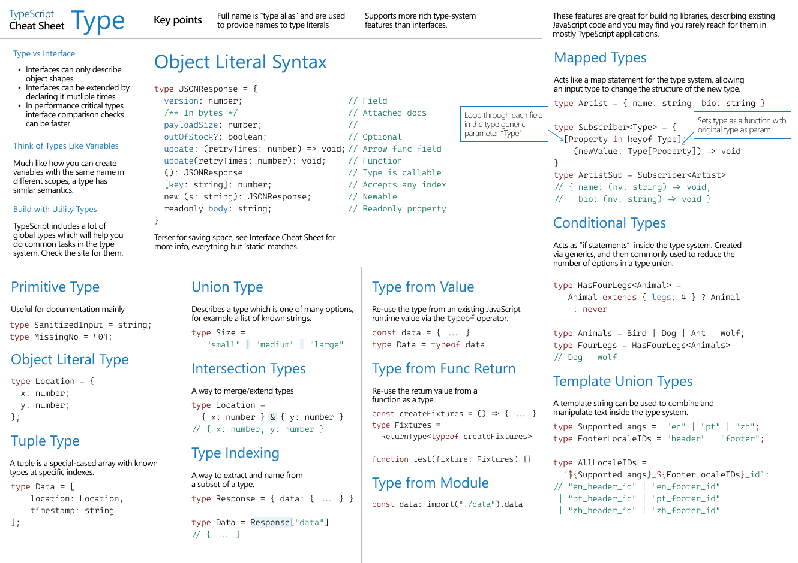

Created using CRA with typescript.


For setting up typescript with exsisting react project, install following packages.

```js
npm install --save typescript @types/node @types/react @types/react-dom
```

## Typescript cheat sheet



